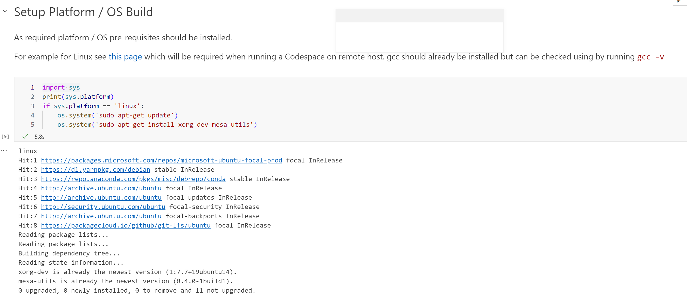
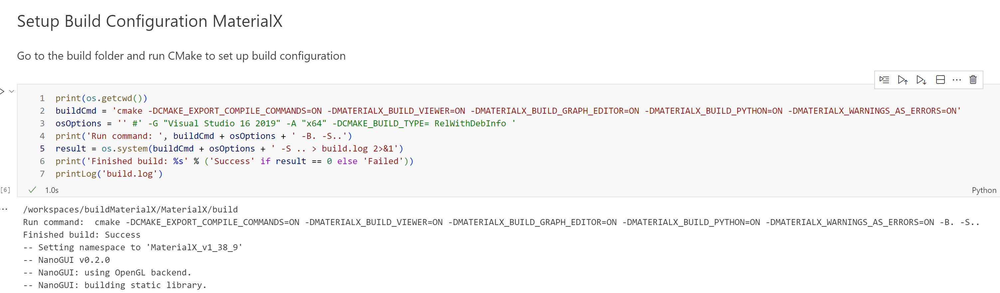
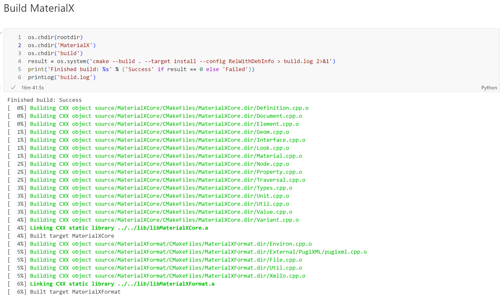
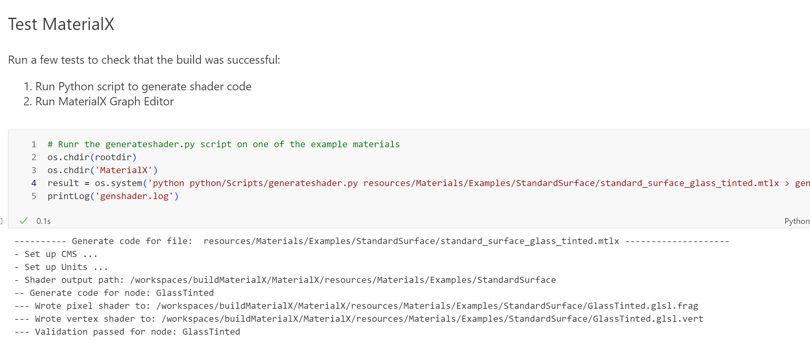
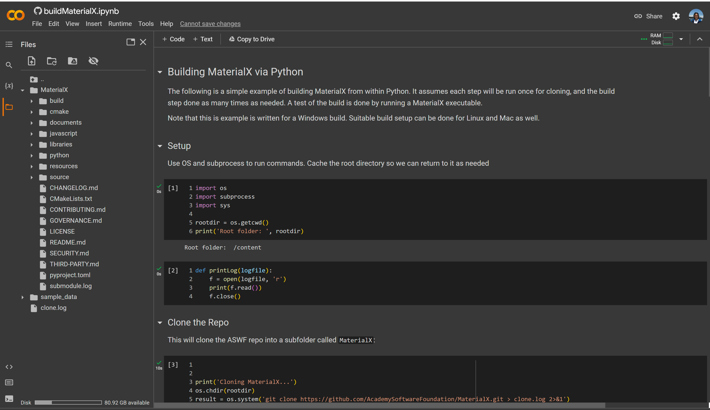
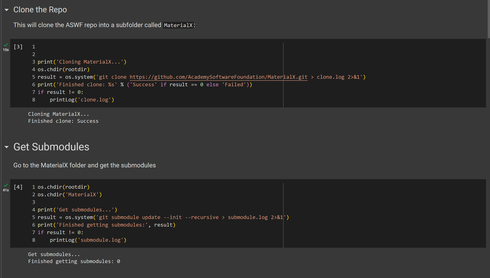
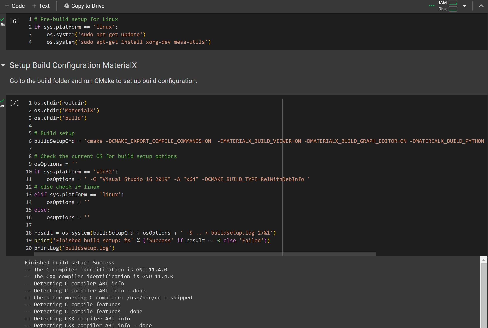
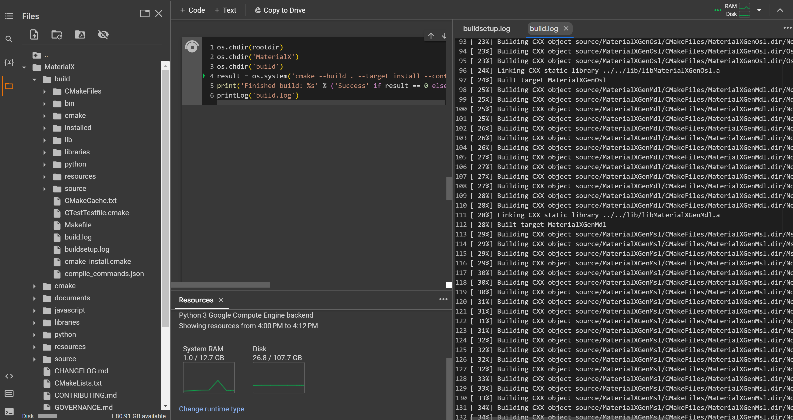
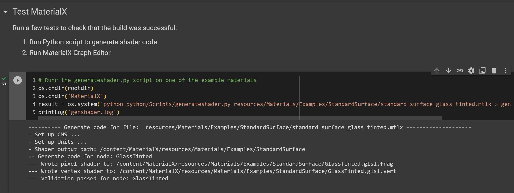

# buildMaterialX

This repo contains a scripts and Jupyter notebook to build MaterialX from source.

The [buildMaterialX.ipynb](buildMaterialX.ipynb) notebook contains the steps required to:

1. Clone the MaterialX repo
2. Install the required dependencies

    

3. Create a build environment

    

4. Build MaterialX

    

5. Run the MaterialX

    

# Usage

## Codespaces

The repo can be cloned or forked from and either run locally or in a `GitHub Codespace`. The snapshots above are from a `GitHub Codespace`. 

## Colab

The notebook can be opened and run in `Google Colab` directly. 

> Note that the "basic" tier does not give you access to a command line (unlike `Codespaces`). As all commands are run through "system" calls from Python the same notebook can be used unmodified for both `Colab` and `Codespaces`.

Below are snapshots from the execution of various steps (cells) of the notebook.

1. Layout
    

2. Clone and Submodule Update

    Note that this step is much faster than when performed from within a codespace, but this is incidendental and may not a reflection of the general performance of the codespace.

    

3. OS and Cmake setup

    This step also appears to be very fast, but it could be due to caching or pre-install of some OS elements.

    

4. Build
    The times to build appears to be faster for codespace from the single sample test which took about 15 minutes using `Codespaces` and 25 minutes using `Colab`. While not comparable to desktop build times, this with the caveat that this was attempted with resources available with the "free" tier of each service. 
    
    Note that it was useful to be able to see resource usage in `Colab` while building. The build log is shown on the right.

    

5. Testing

    

For both `Codespaces` and `Colab`, the cells of the notebook can be (re)run as needed with the caveat that the package imports and the utility to print the logged output be run.

All output is logged to "log" files for later inspection. 

# Caveats

Files can be modified in the source directory and the build rerun to test changes. Note that this will not update the cloned repo.

Remote `Codespaces` and `Colab` may not support GPU rendering (vs compute) as such trying to execute rendering may result in an error. For example the MaterialX Viewer and Graph Editor cannot be run remotely.

